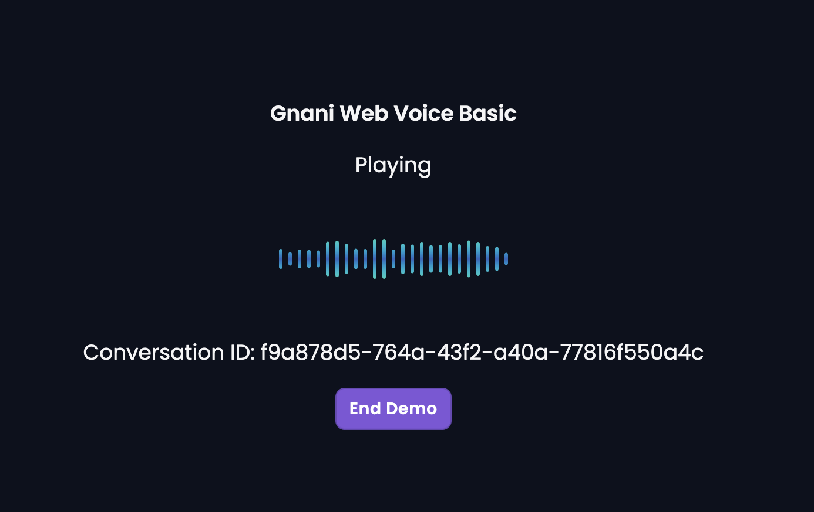

# Web Voice Hook by Gnani.AI

A **React hook** for real-time bidirectional WebSocket voice: capture microphone → server (STT), play TTS ← server. Published as `@gnani.ai/web-voice-hook`.


---

## Installation

In your application project:

```bash
pnpm add @gnani.ai/web-voice-hook
```

Or with npm:

```bash
npm install @gnani.ai/web-voice-hook
```

---

## Quick start

### 1. Use the hook (no extra setup)

The Audio Worklet is **embedded** in the package and loaded at runtime via a Blob URL. You don't need to copy or host any worklet file — just use the hook with the default options. If you prefer to serve the worklet yourself (e.g. custom path or base path), copy `src/audio-processor.js` from this repo into your app's public folder and pass `workletPath` in the hook options.

### 2. Use the hook

**Option A — Direct use** (you build the WebSocket URL yourself):

```tsx
import { useWebSocketAudio as useWebSocketAudioHook } from '@gnani.ai/web-voice-hook';
import type { IUseWebVoiceOptions } from '@gnani.ai/web-voice-hook';

const {
  isConnected,
  isPlaying,
  connect,
  disconnect,
  reconnect,
  startRecording,
  stopRecording,
  isRecording,
} = useWebSocketAudioHook({
  websocketUrl: 'wss://your-api/voice',
  visualizerOptions: { elementId: 'visualizer-canvas', color: '#9E77ED' },
  events: {
    onOpen: () => console.log('Connected'),
    onClose: (source) => console.log('Closed', source),
    onException: (err) => console.error(err),
  },
  logger: { info: console.log, error: console.error },
} as IUseWebVoiceOptions);
```

**Option B — Wrapper hook** (build URL from app config/auth and pass through):

```tsx
import { useWebSocketAudio as useWebSocketAudioHook } from '@gnani.ai/web-voice-hook';
import type { IUseWebVoiceOptions } from '@gnani.ai/web-voice-hook';
import { useMemo } from 'react';
import { v4 } from 'uuid';

// Example: your app builds websocketUrl from agentId, auth, etc.
export const useWebSocketAudio = ({
  agentId,
  onClose,
  onConversationIdGenerated,
  visualizerColor,
  accessToken
}) => {
  const callId = useMemo(() => v4(), []);

  const websocketUrl = useMemo(() => {
    if (!agentId) return undefined;
    return buildVoiceWebSocketUrl(agentId, callId, accessToken);
  }, [agentId, callId, accessToken]);

  onConversationIdGenerated?.(callId);

  const hook = useWebSocketAudioHook({
    websocketUrl,
    conversationId: callId,
    visualizerOptions: { elementId: 'visualizer-canvas', color: visualizerColor },
    events: {
      onOpen: () => console.log('WebSocket connected'),
      onClose: (source) => {
        console.log('WebSocket closed', source);
        onClose?.(source);
      },
      onException: (error) => {
        console.error('WebSocket error', error);
        Sentry.captureException(error); // optional
      },
    },
    logger: { info: console.log, error: console.error },
  } as IUseWebVoiceOptions);

  return {
    ...hook,
    conversationId: callId,
  };
};
```



Then in your UI, call your wrapper (e.g. `useWebSocketAudio({ variant, agentId, onClose, ... })`) and use `connect`, `disconnect`, `startRecording`, `stopRecording`, etc.

---

## API

### Hook: `useWebSocketAudio(options)`

**Options** (`IUseWebVoiceOptions`):

| Option | Type | Required | Description |
|--------|------|----------|-------------|
| `websocketUrl` | `string` | ✅ | WebSocket URL (e.g. `wss://api.example.com/voice`). |
| `conversationId` | `string` | No | For your app; not sent by the hook. |
| `visualizerOptions` | `object` | No | `elementId`, `color`, `options`. |
| `events` | `object` | No | `onOpen`, `onClose`, `onException`. |
| `logger` | `{ info, error }` | No | Logging; defaults to console. |

**Returns:** `isConnected`, `isPlaying`, `connect`, `disconnect`, `reconnect`, `startRecording`, `stopRecording`, `isRecording`.

---

## WebSocket protocol (reference)

**Client → server:** `start`, `media` (base64 µ-law), `TTS_PLAYING`, `EOC`.  
**Server → client:** `media` (base64 TTS), `barge`/`BARGE`, `EOC`, `stop`.

---

## Pushing changes (release steps)

When publishing a new patch version of this package, from the repo root run:

```bash
pnpm run release:patch
```

This script: builds the package, stages all changes, commits with message `build: v<current-version>` (or skips commit if nothing to commit), bumps the patch version, then pushes commits and tags.

For a **minor** or **major** bump, run the steps manually and use `pnpm version minor` or `pnpm version major` instead of `pnpm version patch` before pushing.

Consumers can then install the new tag, e.g. `#v1.0.2`.

---

## Troubleshooting

- **"Failed to load worklet"** — By default the worklet is embedded (no hosting). If you pass a custom `workletPath`, ensure that URL serves the worklet script (e.g. copy `src/audio-processor.js` from this repo to your public folder).
- **No sound / no mic** — Check mic permissions; use `events.onException` and `logger`.
- **Visualizer not showing** — Set `visualizerOptions.elementId` to a mounted element id; install `audiomotion-analyzer`.

---

## TypeScript

```ts
import type { IUseWebVoiceOptions, IWebVoiceLogger, ISocketEventData, ISocketMessage } from '@gnani.ai/web-voice-hook';
```
